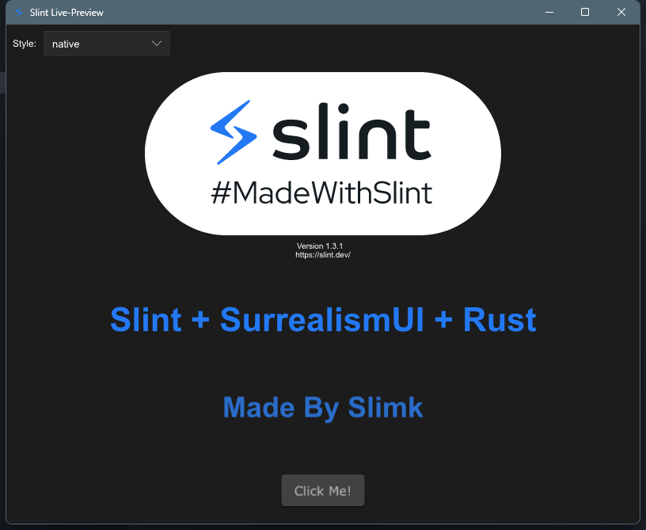

# Slimk

A package manager for creating Slint with SurrealismUI

- author : syf20020816@outlook.com
- createDate : 20231115
- updateDate : 20231203
- version : 0.0.1

## Commands

### Create Slint Project

create a project by selecting configuration items

```bash
# use default strategy to create a new project
> slimk create hello 
# create a new project with a template
> slimk create hello --template slimk
> slimk create hello -t slimk
```
### Init an empty Slint Project

this command creates a new project but use the default strategy with no template , you will get an empty slint project

> you do not need to name the project , this way will use your root directory

```bash
# no name
> slimk init
# with name
> slimk init hello
```
### Select Templates(Native,Remote)

```bash
# native
> slimk list -n
# remote 
> slimk list -r
# both
> slimk list -a
```
### Select Configuration

```bash
> slimk config --get update

> slimk config --get create
```

## Error Description

### Network

Due to the lack of an independent server, I have designed it to rely on Github. 
Therefore, if you are unable to connect well to Github, the initialization of SLNs is likely to display network errors

```bash
Slimk : init conf successfully!
Slimk : Downloading | Updating default template...
thread 'main' panicked at 'download failed, please check your network settings!', src\lib\core.rs:229:21
note: run with `RUST_BACKTRACE=1` environment variable to display a backtrace
```

#### solve

1. go to : https://github.com/Surrealism-All/slimk-template and download latest release
2. unzip it into repo directory
3. write the following configuration into natives

```json
{
  "natives": {
    "slimk-binary": {
      "id": 1701616493916,
      "url": "E:\\slimk\\repo\\slimk-binary",
      "note": "this is a native default template use Slint with SurrealismUI"
    }
  }
}
```
## Res

## Goals

- [x] : create command
- [x] : init command
- [x] : list command
- [x] : config command 
- [x] : --list options

## Next Version Goals (V0.2+)

1. Reduce the module section in the release of the slimk-template repository : Detach modules when downloading templates to prevent them from being forcibly dependent
2. Add install command to add module into ui 
3. More humanized
4. Stronger interaction